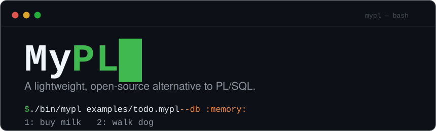

<p align="center">
  
</p>

<p align="center">
  <a href="https://github.com/LPuehringerStudent/MyPL/actions/workflows/main.yml"></a>
  <a href="https://github.com/LPuehringerStudent/MyPL/actions/workflows/windows.yml"></a>
  <a href="LICENSE"></a>
  
</p>

MyPL is a small scripting language with C-like syntax and SQL in its veins.
It compiles to bytecode for a custom stack VM and runs against either its
built-in SQL engine or SQLite. Stored-procedure scripting without the weight
of an Oracle installation.

```mypl
proc add_todo(title string) -> int {
    insert into todos (title, done) values (?title, 0);
    return 0;
}

proc list_todos() -> int {
    for todo in select id, title from todos {
        print concat(int_to_string(todo.id), concat(": ", todo.title));
    }
    return 0;
}
```

## Quick start

```bash
git clone https://github.com/LPuehringerStudent/MyPL.git
cd MyPL
make
./bin/mypl examples/todo.mypl --db :memory:
```

## Highlights

- **SQL in the language**: inline DDL/DML with `?var` binding,
  `for row in select ...`, `SELECT ... INTO`, explicit cursors, statement-
  and row-level triggers (`before insert`, `for each row`, `:new`/`:old`),
  persistent sequences (`nextval`/`currval`), views (`create view`),
  B-tree indexes, constraints, and three-valued NULLs.
- **A real procedural language**: procedures and functions with
  `in`/`out`/`in out` modes, structs and object types with methods,
  `array<T>`/`map<K,V>` collections, `case`, exception handling,
  Packages with spec/body and persisted state, subtypes, `%TYPE`/`%ROWTYPE`.
- **Batteries included**: `dbms_output`, the `dbms_sql` dynamic-SQL cursor
  API (`dbms_sql.open_cursor`), `utl_file` for host files
  (`utl_file.fopen`), ~90 standard-library natives, regex support, and FFI
  to C libraries via `external_call`/`external_call_sig`.
  On all three platforms.
- **Two SQL engines**: the SQLite backend (`--db <path>`, `.connect`,
  `:memory:`) or the built-in Custom SQL engine with zero dependencies.
- **Hacker-friendly tooling**: a REPL with history and line editing on
  Linux, macOS, and Windows; Conditional compilation with `$if`/`$define`
  and `-DNAME` flags; file imports; a libFuzzer harness with a regression
  corpus; CI on three operating systems.

## Documentation

Full documentation lives in [`docs/`](docs/):

- [`docs/language.md`](docs/language.md) — the language, top to bottom
- [`docs/engines.md`](docs/engines.md) — the two SQL backends and their limits
- [`docs/examples.md`](docs/examples.md) — guided tour of the runnable examples
- `mypl.1` — man page (build, CLI, REPL)

## Build

Default build (needs the `sqlite3` dev library; on Ubuntu
`sudo apt-get install libsqlite3-dev`, on macOS `brew install sqlite3`):

```bash
make clean && make && make test
```

Standalone build without SQLite (custom engine only, `--db` disabled):

```bash
make clean && make USE_SQLITE=0 && make USE_SQLITE=0 test
```

On Windows, build in an [MSYS2](https://www.msys2.org/) MINGW64 shell:

```bash
pacman -S make mingw-w64-x86_64-gcc mingw-w64-x86_64-sqlite3 mingw-w64-x86_64-libsystre
make clean && make && make test
```

The Windows REPL uses the console API for history and in-line editing;
piped input falls back to plain line reading.

## Contributing

Contributions and ideas are welcome — see
[`CONTRIBUTING.md`](CONTRIBUTING.md) for the workflow (failing-test-first,
clean rebuilds, sanitizer checks) and [`SECURITY.md`](SECURITY.md) for
reporting vulnerabilities.

## License

[MIT](LICENSE)
